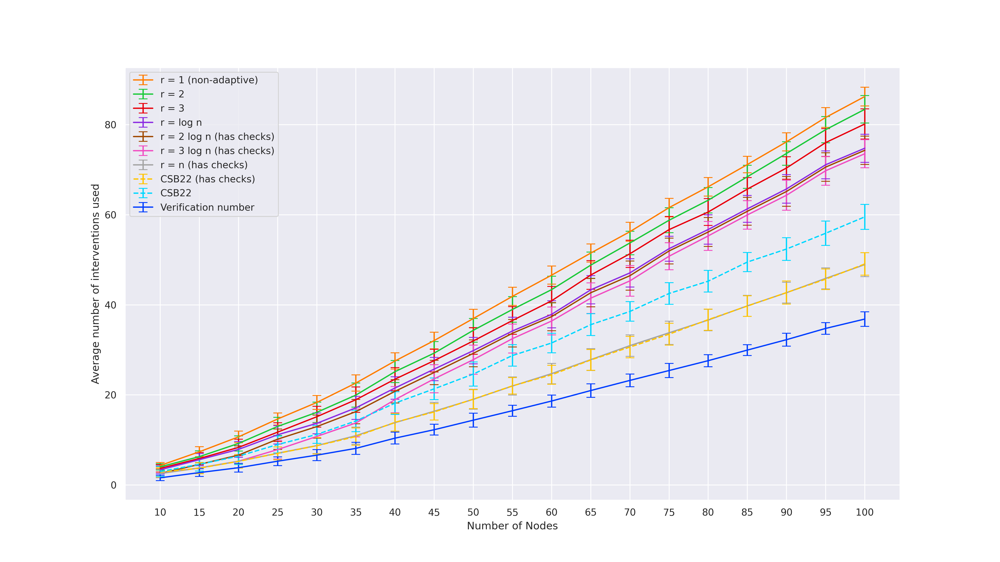
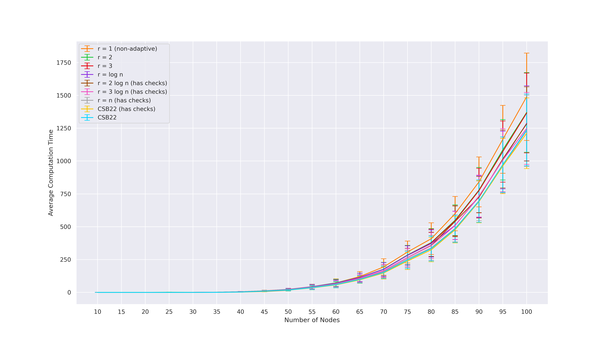
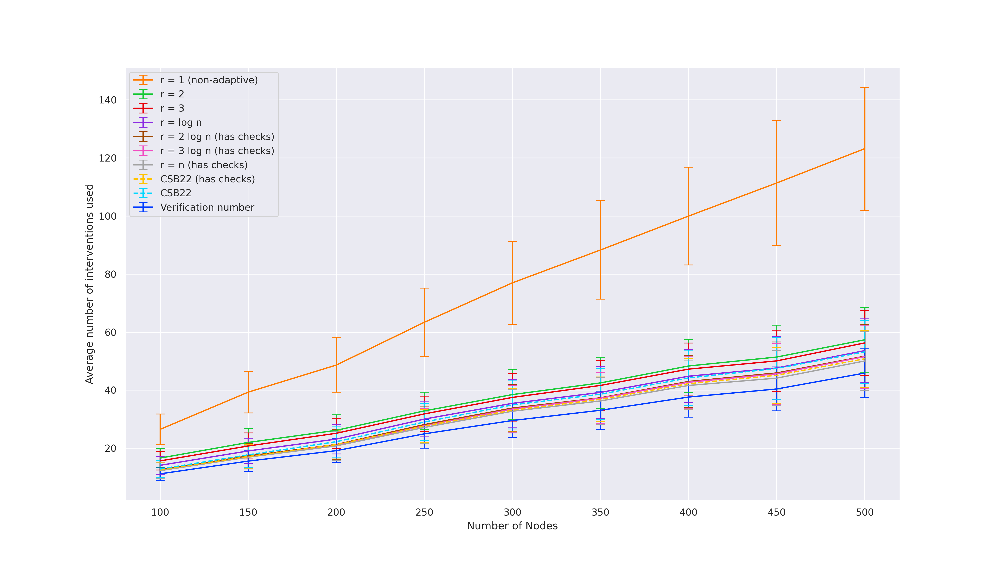
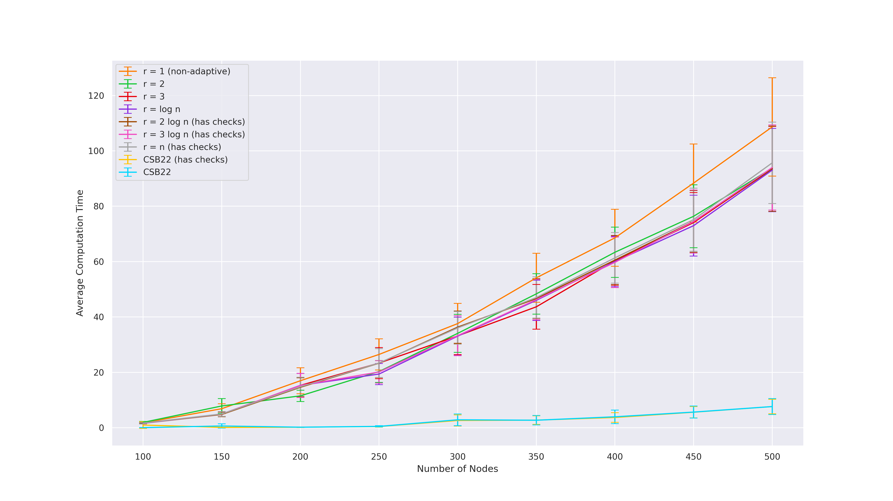
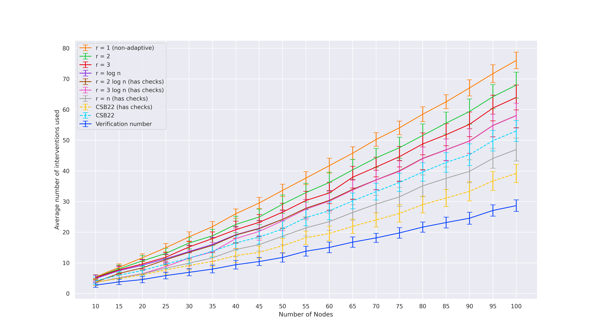
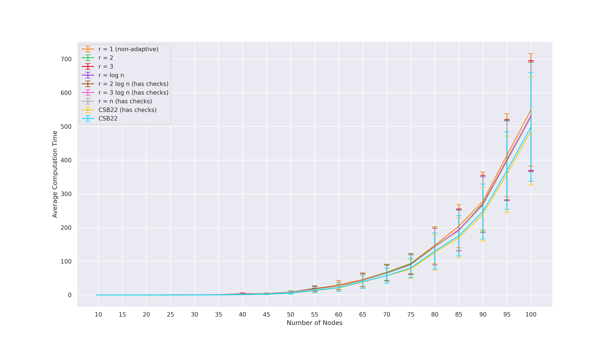

# Adaptivity Complexity for Causal Graph Discovery
This is the accompanying repository of the Accompanying repository for "Adaptivity Complexity for Causal Graph Discovery". It is available at https://arxiv.org/abs/2306.05781.

We have included a copy of the produced `figures` sub-directory in here so you may look at the output without running the experiments yourself.

## Implementation details

#### Checks to avoid redundant interventions

The current implementation of [CSB22]'s `separator` algorithm is actually $n$-adaptive because it performs "checks" before performing each intervention --- if the vertices in the proposed intervention set $S$ do _not_ have any unoriented incident arcs, then the intervention set $S$ will be skipped.
One may think of such interventions as "redundant" since they do not yield any new information about the underlying causal graph.
As such, we ran two versions of their algorithm: one without checks (i.e. $\mathcal{O}(\log n)$-adaptive) and one with checks (i.e. $n$-adaptive).
Note that each check corresponds to an adaptivity round because an intervention within a batch of interventions may turn out to be redundant, but we will only know this after performing a check after some of the interventions within that batch have been executed.

#### Scaling our algorithm with checks

Since $n^{\frac{1}{\log n}} = 2$, running our adaptivity-sensitive algorithm (as it is) with adaptivity parameters $r \in \Omega(\log n)$ does not make much sense.
As such, we define a checking budget $b = r - \lceil \log n \rceil$ and greedily perform up to $b$ checks whilst executing our Algorithm 2.
This allows our Algorithm 2 to scale naturally for $r \in \Omega(\log n)$.

#### Non-adaptive intervention round

For the final round of interventions, let $V'$ be the set of remaining relevant vertices.
From our algorithm, we know that $|V'| \leq L$ but we may even intervene on less vertices in the final round.
By [KDV17], we only need to intervene on a graph-separating system of the subgraph $G[V']$.
For atomic interventions, this exactly correspond to the minimum vertex cover of $V'$.
To obtain this, we first compute the maximum independent set $S$ of $V'$ (which can be computed efficiently on chordal graphs [G72,L84], then only intervene on $V' \setminus S$.

#### Optimization before final round

Note that we can always compute the intervention set $F \subseteq V$ which we _would_ have intervened if $r=1$.
At any point in time of the algorithm, if $F$ involves less vertices than the number of vertices required from the $L$-partitioning, then we simply treat the current adaptivity round as the final round, choose to intervene on $F$ and use any remaining adaptive budget for performing checks.

## Synthetic graphs

We use synthetic moral randomly generated graphs from earlier prior works [SMG+20,CSB22,CS23].
For each of the graph classes and parameters, we generate 100 DAGs and plot the average with an error bar.

1. Erdős-Rényi styled graphs (used by [SMG+20,CSB22])  
These graphs are parameterized by 2 parameters: number of nodes $n$ and density $\rho$. Generate a random ordering $\sigma$ over $n$ vertices. Then, set the in-degree of the $n^{th}$ vertex (i.e.\ last vertex in the ordering) in the order to be $X_n = \max\\{1, \texttt{Binomial}(n-1, \rho)\\}$, and sample $X_n$ parents uniformly form the nodes earlier in the ordering. Finally, chordalize the graph by running the elimination algorithm of [KF09] with elimination ordering equal to the reverse of $\sigma$.  
__Parameters used:__ $n = \\{10, 15, 20, \ldots, 95, 100\\}$ and $\rho = 0.1$.

2. Tree-like graphs (used by [SMG+20,CSB22])  
These graphs are parameterized by 4 parameters: number of nodes $n$, degree $d$, $e_{\min}$, and $e_{\max}$. First, generate a complete directed $d$-ary tree on $n$ nodes. Then, add $\texttt{Uniform}(e_{\min}, e_{\max})$ edges to the tree. Finally, compute a topological order of the graph by DFS and triangulate the graph using that order. As the original definition of this graph class by [SMG+20] becomes very sparse as $n$ grows, we tweaked the other parameters to scale accordingly by defining new parameters $d_{prop}, e_{\min, prop}, e_{\max, prop} \in [0,1]$ as follows: $d = n \cdot d_{prop}$, $e_{\min} = n \cdot e_{\min, prop}$, and $e_{\max} = n \cdot e_{\max, prop}$.  
__Parameters used:__ $n = \\{100, 150, 200, \ldots, 450, 500\\}$, $d_{prop} = 0.4$, $e_{\min, prop} = 0.2$, $e_{\max, prop} = 0.5$.

3. $G(n,p)$-union-tree (used by [CS23])  
These graphs are parameterized by 2 parameters: number of nodes $n$ and edge probability $p$. An Erdős-Rényi $G(n,p)$ and a random tree $T$ on $n$ vertices are generated. Take the union of their edge sets, orient the edges in an acyclic fashion, then add arcs to remove v-structures.  
__Parameters used:__ $n = \\{10, 15, 20, \ldots, 95, 100\\}$ and $p=0.03$.

## Algorithms benchmarked

While both the algorithm of [CSB22] and our Algorithm 2 have been implemented to take in a parameter $k$ for bounded-size interventions, our experiments focused on the case of atomic interventions, i.e. $k = 1$.

- `separator`:
Algorithm of [CSB22]. With checks, it allows for full adaptivity.

- `separator_no_check`:
`separator` but we remove checks that avoid redundant interventions, i.e. $\mathcal{O}(\log n)$ rounds of adaptivity.

- `adaptive_r1`:
Our Algorithm 2 with $r = 1$, i.e. non-adaptive

- `adaptive_r2`:
Our Algorithm 2 with $r = 2$

- `adaptive_r3`:
Our Algorithm 2 with $r = 3$

- `adaptive_rlogn`:
Our Algorithm 2 with $r = \log_2 n$

- `adaptive_r2logn`:
Our Algorithm 2 with $r = 2 \log_2 n$. Can perform checks that avoid redundant interventions.

- `adaptive_r3logn`:
Our Algorithm 2 with $r = 3 \log_2 n$. Can perform checks that avoid redundant interventions.

- `adaptive_rn`:
Our Algorithm 2 with $r = n$, i.e. full adaptivity allowed

## Experimental results

As expected, we observe that higher rounds of adaptivity leads to lower number of interventions required.
When $r=n$, Algorithm 2 can match [CSB22] with its full adaptivity.

## Experimental plots

#### Experiment 1

#### Experiment 2

#### Experiment 3

## References

[G72] Fănică Gavril. Algorithms for minimum coloring, maximum clique, minimum covering by cliques, and maximum independent set of a chordal graph. SIAM Journal on Computing, 1(2):180–187, 1972. Available at: https://epubs.siam.org/doi/abs/10.1137/0201013?journalCode=smjcat

[L84] Joseph Y-T Leung. Fast algorithms for generating all maximal independent sets of interval, circular-arc and chordal graphs. Journal of Algorithms, 5(1):22–35, 1984. Available at: https://www.sciencedirect.com/science/article/abs/pii/0196677484900373

[KF09] Daphne Koller and Nir Friedman. Probabilistic graphical models: principles and techniques. MIT press, 2009. Available at: https://mitpress.mit.edu/9780262013192/probabilistic-graphical-models

[KDV17] Murat Kocaoglu, Alex Dimakis, and Sriram Vishwanath. Cost-Optimal Learning of Causal Graphs. In International Conference on Machine Learning, pages 1875–1884. PMLR, 2017. Available at: https://arxiv.org/pdf/1703.02645.pdf

[SMG+20] Chandler Squires, Sara Magliacane, Kristjan Greenewald, Dmitriy Katz, Murat Kocaoglu, and Karthikeyan Shanmugam. Active Structure Learning of Causal DAGs via Directed Clique Trees. Advances in Neural Information Processing Systems, 2020. Available at: https://arxiv.org/pdf/2011.00641.pdf

[CSB22] Davin Choo, Kirankumar Shiragur, and Arnab Bhattacharyya. Verification and search algorithms for causal DAGs. Advances in Neural Information Processing Systems, 2022. Available at https://arxiv.org/pdf/2206.15374.pdf

[CS23] Davin Choo, and Kirankumar Shiragur. Subset verification and search algorithms for causal DAGs. International Conference on Artificial Intelligence and Statistics, 2023. Available at https://arxiv.org/pdf/2301.03180.pdf.
